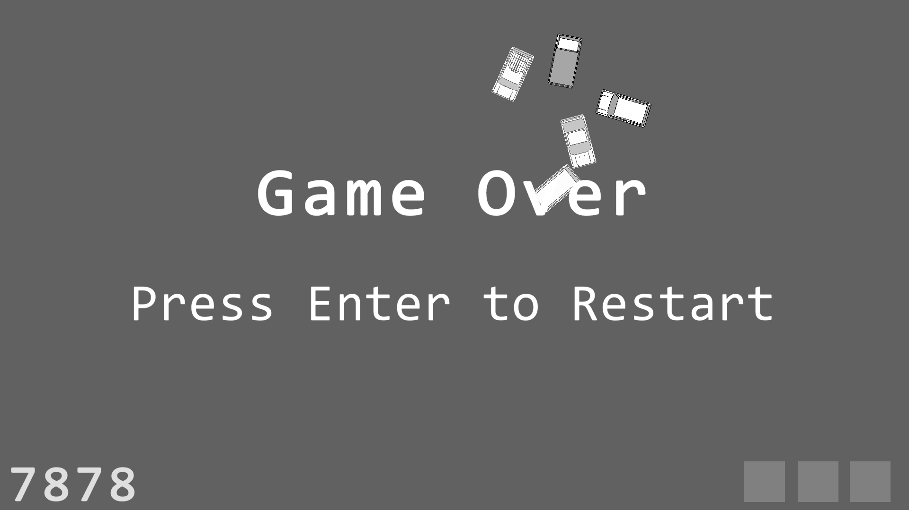

# DodgeM

23-1 KUCC 게임잼에서 만든 자동차 피하기 게임  
(KUCC는 학교 컴퓨터 동아리이다.)  

Unity를 사용해서 제작되었다.  
https://lnxhigh.github.io/DodgeM/  

게임의 모티브는 놀이공원의 범퍼카이다.  
하루동안 동심을 주제로 한 게임을 만드는 것이 과제였다.  
시간이 부족해서 디자인을 하지 못했다.  

범퍼카는 영어로 Bumper car 또는 Dodgem car 라 하여, 이와 같은 이름을 사용했다.  
Dodge는 '피하다'라는 뜻이 있으므로 DodgeM이라 이름을 지었다.  

## How to play

키보드 A, W, S, D 를 사용해서 플레이어를 움직인다.

4대의 차가 플레이어를 쫓아온다.  
플레이어와 세 번 이상 부딪히면 게임이 끝난다.  
오래 살아 있을수록 높은 점수를 얻는다.

## 구현

### 가속

키보드를 오래 누르고 있으면 그만큼 가속이 일어난다.  
키보드에서 손을 떼면 감속이 일어난다.  

적들 또한 가속 또는 감속이 일어난다.  

acceleration 값과 deceleration 값을 정해서 이에 따라 가속 또는 감속된다.

### 회전

이동 방향을 감지해서 자동차의 회전이 일어난다.  
Quaternion이 사용된다. 다음을 참조했다.  

https://www.youtube.com/watch?v=gs7y2b0xthU&t=367s

### 충돌

벽에 부딪히면 비탄성충돌이 일어난다.  
Rigidbody2D 와 Physics Material 2D 가 사용된다.

### 플레이어 추적

적들이 다음에 이동할 방향을 결정하기 위해 두 가지 벡터가 사용된다.

**A. 적에서 플레이어로 향하는 벡터**  
**B. 적의 입장에서 자신과 가장 가까운 벽에서 자신으로 향하는 벡터**  

A와 B를 합한 벡터가 적의 다음 이동 방향이 된다.  

A를 사용하면 적이 플레이어를 추적할 수 있다.  
B를 사용하면 적이 벽에 부딪히는 속도를 늦출 수 있다.  

벽과의 거리(B의 크기)가 가까울수록 B의 가중치를 크게 했다. (B의 크기의 역수를 사용)  
또한 적과 플레이어의 거리(A의 크기)가 일정 이상 가까워지면 적이 반대 방향으로 가속되도록 했다.

적이 반대 방향으로 가속해도 관성이 있어서 플레이어와 충돌하게 된다.  
이는 적의 움직임을 예측하기 어렵게 만드는 역할을 하며, 역설적으로 게임의 난이도를 낮춘다.
